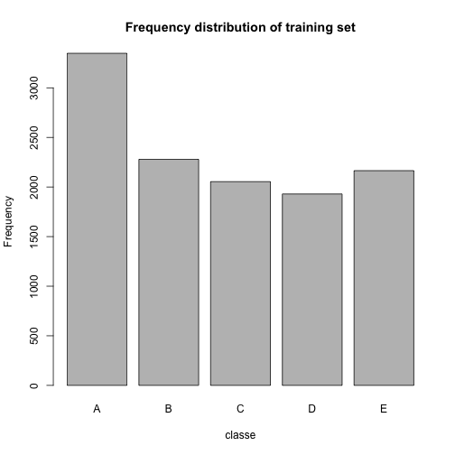
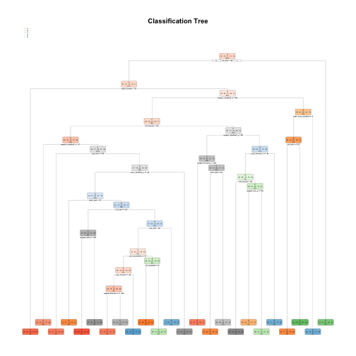
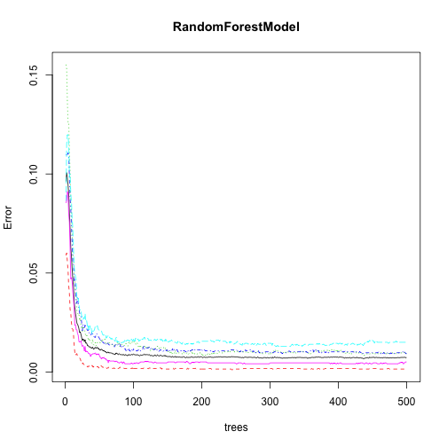
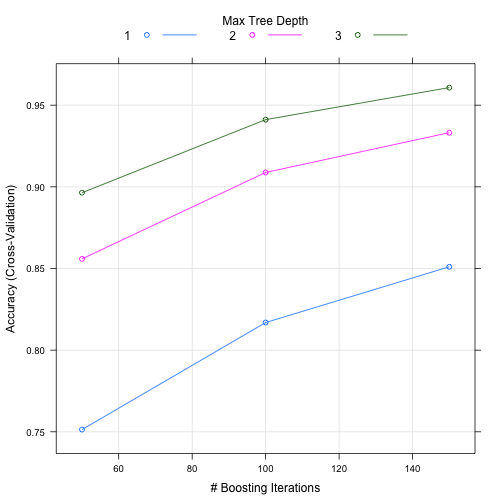

Prediction Assignment Writeup
=============================
### Introduction ###
The quantified self movement use devices such as Jawbone Up, Nike FuelBand, and Fitbit to collect a large amount of data about personal activity in order to improve their health, to find patterns in their behavior, or because they are tech geeks. One thing that people regularly do is quantify how much of a particular activity they do, but they rarely quantify how well they do it. 

A number of volunteers were asked to perform barbell lifts correctly and incorrectly in 5 different ways (see "classe" variable in the training set), where A refers to accurate methodology and B, C, D, E are inaccurate methodologies. The goal of this project is to use data from accelerometers on the belt, forearm, arm, and dumbell of 6 participants in order to predict the manner in which they did the exercise.


## Data Review and Preparation ##

Include relevant libraries

```
## Loading required package: lattice
```

```
## Loading required package: ggplot2
```

```
## Want to understand how all the pieces fit together? See the R for
## Data Science book: http://r4ds.had.co.nz/
```

```
## randomForest 4.6-14
```

```
## Type rfNews() to see new features/changes/bug fixes.
```

```
## 
## Attaching package: 'randomForest'
```

```
## The following object is masked from 'package:ggplot2':
## 
##     margin
```

Download the pml-testing and pml-training csv files and physically review to try and understand the nature of the data sets prior to reading them in. The pml-training file seems much larger than the pml-testing file.


## Data Exploration ##
The downloaded csv files have a number of fields that are empty or have #DIV/0! or NA characters, which will be removed in order not to affect the performance of the prediction models.


### Feature Selection ###
The pmltraining file has 19622 rows and 160 columns. The pmltesting file has 20 rows and 160 columns, the files have the same number of columns, 160 columns of which 159 have the same column headings. Some of these columns contain NA's. 
As previously mentioned, missing data can affect the performance of the predictive models therefore, we extract only non-NA columns from the testing dataset. 


```r
names(pmltesting[, colSums(is.na(pmltesting)) == 0])
```

```
##  [1] "X"                    "user_name"            "raw_timestamp_part_1"
##  [4] "raw_timestamp_part_2" "cvtd_timestamp"       "new_window"          
##  [7] "num_window"           "roll_belt"            "pitch_belt"          
## [10] "yaw_belt"             "total_accel_belt"     "gyros_belt_x"        
## [13] "gyros_belt_y"         "gyros_belt_z"         "accel_belt_x"        
## [16] "accel_belt_y"         "accel_belt_z"         "magnet_belt_x"       
## [19] "magnet_belt_y"        "magnet_belt_z"        "roll_arm"            
## [22] "pitch_arm"            "yaw_arm"              "total_accel_arm"     
## [25] "gyros_arm_x"          "gyros_arm_y"          "gyros_arm_z"         
## [28] "accel_arm_x"          "accel_arm_y"          "accel_arm_z"         
## [31] "magnet_arm_x"         "magnet_arm_y"         "magnet_arm_z"        
## [34] "roll_dumbbell"        "pitch_dumbbell"       "yaw_dumbbell"        
## [37] "total_accel_dumbbell" "gyros_dumbbell_x"     "gyros_dumbbell_y"    
## [40] "gyros_dumbbell_z"     "accel_dumbbell_x"     "accel_dumbbell_y"    
## [43] "accel_dumbbell_z"     "magnet_dumbbell_x"    "magnet_dumbbell_y"   
## [46] "magnet_dumbbell_z"    "roll_forearm"         "pitch_forearm"       
## [49] "yaw_forearm"          "total_accel_forearm"  "gyros_forearm_x"     
## [52] "gyros_forearm_y"      "gyros_forearm_z"      "accel_forearm_x"     
## [55] "accel_forearm_y"      "accel_forearm_z"      "magnet_forearm_x"    
## [58] "magnet_forearm_y"     "magnet_forearm_z"     "problem_id"
```

There are 60 columns within the pmltesting file with non-NA values present. Ensure you're comparing like with like within the datasets by picking features relevant to both. We will leave out the first 7 columns from the pmltesting dataset.

```r
compareLike <- names(pmltesting[, colSums(is.na(pmltesting)) == 0])[8:59]
pmltraining <- pmltraining[, c(compareLike, "classe")]
pmltesting <- pmltesting[, c(compareLike, "problem_id")]
```

### Data Partitioning ###
Split the training dataset (60/40) in order to estimate the out of sample error. 


```r
set.seed(100)
inTrain <- createDataPartition(pmltraining$classe, p = 0.6, list = FALSE)
training <- pmltraining[inTrain, ]
testing <- pmltraining[-inTrain, ]
```
The training subset is used to train the model

Frequency distribution of training set

```r
plot(training$classe, main = "Frequency distribution of training set", xlab = "classe", ylab = "Frequency")
```



## Model Selection ##
Qualities to be considered during model selection include: Accuracy, Speed, Intepretability, Ease of use ans Scalability. The available data is also non-linear, therefore, the following models have been selected to determine the best out-of-sample accuracy.
- Decision Tree Model - visually interpretable, fast and compact
- Random Forest Model - accurate, detects variables interaction assigns feature importance and flexible
- Gradient Boosting Model - detects feature interactions and fast predictions (although slow training)
10-fold cross validation has been used with all cases.

### Decision Tree Model ###
Create the decision tree. 

```r
set.seed(200)
ptm <- proc.time()
DecisionTreeModel <- rpart(classe ~ ., data = training, method = "class", control = rpart.control(method = "cv", number = 10))
proc.time() - ptm
```

```
##    user  system elapsed 
##   2.420   0.038   2.795
```

```r
# Calculate out of sample error
predictionDT <- predict(DecisionTreeModel, testing, type = "class")
cMatrixDT <- confusionMatrix(predictionDT, testing$classe)
cMatrixDT
```

```
## Confusion Matrix and Statistics
## 
##           Reference
## Prediction    A    B    C    D    E
##          A 1968  353   20  121   41
##          B   48  845   83   40   92
##          C   58  143 1170  192  163
##          D   85  111   81  837   74
##          E   73   66   14   96 1072
## 
## Overall Statistics
##                                           
##                Accuracy : 0.751           
##                  95% CI : (0.7412, 0.7605)
##     No Information Rate : 0.2845          
##     P-Value [Acc > NIR] : < 2.2e-16       
##                                           
##                   Kappa : 0.6839          
##  Mcnemar's Test P-Value : < 2.2e-16       
## 
## Statistics by Class:
## 
##                      Class: A Class: B Class: C Class: D Class: E
## Sensitivity            0.8817   0.5567   0.8553   0.6509   0.7434
## Specificity            0.9047   0.9584   0.9142   0.9465   0.9611
## Pos Pred Value         0.7863   0.7626   0.6779   0.7045   0.8115
## Neg Pred Value         0.9506   0.9001   0.9676   0.9326   0.9433
## Prevalence             0.2845   0.1935   0.1744   0.1639   0.1838
## Detection Rate         0.2508   0.1077   0.1491   0.1067   0.1366
## Detection Prevalence   0.3190   0.1412   0.2200   0.1514   0.1684
## Balanced Accuracy      0.8932   0.7575   0.8847   0.7987   0.8523
```

```r
rpart.plot(DecisionTreeModel, main = "Classification Tree")
```



### Random Forest Model ###
Create the random forest model.

```r
set.seed(300)
ptm <- proc.time()
RandomForestModel <- randomForest(classe ~ ., data = training, method = "rf", importance = T, trControl = trainControl(method = "cv", classProbs = TRUE, savePredictions = TRUE, allowParallel = TRUE, number = 10))
RandomForestModel
```

```
## 
## Call:
##  randomForest(formula = classe ~ ., data = training, method = "rf",      importance = T, trControl = trainControl(method = "cv", classProbs = TRUE,          savePredictions = TRUE, allowParallel = TRUE, number = 10)) 
##                Type of random forest: classification
##                      Number of trees: 500
## No. of variables tried at each split: 7
## 
##         OOB estimate of  error rate: 0.73%
## Confusion matrix:
##      A    B    C    D    E class.error
## A 3343    3    0    0    2 0.001493429
## B   15 2257    7    0    0 0.009653357
## C    1   17 2035    1    0 0.009250243
## D    0    0   27 1901    2 0.015025907
## E    0    0    2    9 2154 0.005080831
```

```r
proc.time() - ptm
```

```
##    user  system elapsed 
##  86.189   0.764  98.021
```

```r
# Calculate out of sample error
predictionRF <- predict(RandomForestModel, testing, type = "class")
cMatrixRF <- confusionMatrix(predictionRF, testing$classe)
cMatrixRF
```

```
## Confusion Matrix and Statistics
## 
##           Reference
## Prediction    A    B    C    D    E
##          A 2230    8    0    0    0
##          B    2 1506    9    0    0
##          C    0    4 1355   17    1
##          D    0    0    4 1269    7
##          E    0    0    0    0 1434
## 
## Overall Statistics
##                                          
##                Accuracy : 0.9934         
##                  95% CI : (0.9913, 0.995)
##     No Information Rate : 0.2845         
##     P-Value [Acc > NIR] : < 2.2e-16      
##                                          
##                   Kappa : 0.9916         
##  Mcnemar's Test P-Value : NA             
## 
## Statistics by Class:
## 
##                      Class: A Class: B Class: C Class: D Class: E
## Sensitivity            0.9991   0.9921   0.9905   0.9868   0.9945
## Specificity            0.9986   0.9983   0.9966   0.9983   1.0000
## Pos Pred Value         0.9964   0.9927   0.9840   0.9914   1.0000
## Neg Pred Value         0.9996   0.9981   0.9980   0.9974   0.9988
## Prevalence             0.2845   0.1935   0.1744   0.1639   0.1838
## Detection Rate         0.2842   0.1919   0.1727   0.1617   0.1828
## Detection Prevalence   0.2852   0.1933   0.1755   0.1631   0.1828
## Balanced Accuracy      0.9988   0.9952   0.9936   0.9926   0.9972
```

```r
plot(RandomForestModel)
```



```r
head(importance(RandomForestModel))
```

```
##                         A        B        C        D        E
## roll_belt        37.12017 44.55474 43.89064 42.57999 38.72825
## pitch_belt       28.65123 46.29191 38.97843 31.91888 30.89368
## yaw_belt         48.30963 44.32432 40.10329 46.20945 33.14024
## total_accel_belt 14.42237 15.37458 14.62905 14.49632 15.61468
## gyros_belt_x     18.29408 15.72124 19.34215 14.66921 14.87433
## gyros_belt_y     10.78865 16.31360 14.70867 14.97121 15.91558
##                  MeanDecreaseAccuracy MeanDecreaseGini
## roll_belt                    50.97531        712.64281
## pitch_belt                   45.63014        405.28418
## yaw_belt                     63.92681        532.76537
## total_accel_belt             17.12102        149.39115
## gyros_belt_x                 25.20997         62.89252
## gyros_belt_y                 19.51249         64.86908
```

### Gradient Boosting Model ###
Create the gradient boosting model.


```r
set.seed(300)
ptm <- proc.time()
GradientBoostingModel <- train(classe ~ ., method = "gbm", data = training, verbose = F, trControl = trainControl(method = "cv", number = 10))
GradientBoostingModel
```

```
## Stochastic Gradient Boosting 
## 
## 11776 samples
##    52 predictor
##     5 classes: 'A', 'B', 'C', 'D', 'E' 
## 
## No pre-processing
## Resampling: Cross-Validated (10 fold) 
## Summary of sample sizes: 10600, 10598, 10598, 10598, 10597, 10598, ... 
## Resampling results across tuning parameters:
## 
##   interaction.depth  n.trees  Accuracy   Kappa    
##   1                   50      0.7513576  0.6846999
##   1                  100      0.8169120  0.7682395
##   1                  150      0.8510478  0.8115292
##   2                   50      0.8558879  0.8173851
##   2                  100      0.9087945  0.8845492
##   2                  150      0.9331667  0.9154210
##   3                   50      0.8963952  0.8688662
##   3                  100      0.9411490  0.9255196
##   3                  150      0.9607655  0.9503503
## 
## Tuning parameter 'shrinkage' was held constant at a value of 0.1
## 
## Tuning parameter 'n.minobsinnode' was held constant at a value of 10
## Accuracy was used to select the optimal model using the largest value.
## The final values used for the model were n.trees = 150,
##  interaction.depth = 3, shrinkage = 0.1 and n.minobsinnode = 10.
```

```r
proc.time() - ptm
```

```
##    user  system elapsed 
## 502.320   6.873 568.054
```

```r
# Calculate out of sample error
predictionGB <- predict(GradientBoostingModel, testing)
cMatrixGBM <- confusionMatrix(predictionGB, testing$classe)
cMatrixGBM
```

```
## Confusion Matrix and Statistics
## 
##           Reference
## Prediction    A    B    C    D    E
##          A 2199   53    0    3    1
##          B   23 1412   33    4   17
##          C    5   47 1313   43   12
##          D    5    5   20 1225   23
##          E    0    1    2   11 1389
## 
## Overall Statistics
##                                           
##                Accuracy : 0.9607          
##                  95% CI : (0.9562, 0.9649)
##     No Information Rate : 0.2845          
##     P-Value [Acc > NIR] : < 2.2e-16       
##                                           
##                   Kappa : 0.9503          
##  Mcnemar's Test P-Value : 3.296e-08       
## 
## Statistics by Class:
## 
##                      Class: A Class: B Class: C Class: D Class: E
## Sensitivity            0.9852   0.9302   0.9598   0.9526   0.9632
## Specificity            0.9898   0.9878   0.9835   0.9919   0.9978
## Pos Pred Value         0.9747   0.9483   0.9246   0.9585   0.9900
## Neg Pred Value         0.9941   0.9833   0.9914   0.9907   0.9918
## Prevalence             0.2845   0.1935   0.1744   0.1639   0.1838
## Detection Rate         0.2803   0.1800   0.1673   0.1561   0.1770
## Detection Prevalence   0.2875   0.1898   0.1810   0.1629   0.1788
## Balanced Accuracy      0.9875   0.9590   0.9716   0.9722   0.9805
```

```r
plot(GradientBoostingModel)
```



### Cross Validation ###
The confusion matrix decision tree has the lowest combined accuracy of 0.75 and a kappa value of 0.68. It also has the lowest sensitivity and specificity (in comparison to random forest and gradient boosting models).
The random forest has the highest combined accuracy of 0.99 and a kappa value of 0.99. It also has the highest sensitivity and specificity values.
The gradient boosting model has an accuracy of 0.96 and a kappa value of 0.95.
The gradient boosting and random forest models provide kappa values that can be described as almost in perfect agreement.


```r
displayModelResults <- data.frame(Model = c("Decision Tree", "Random Forest", "Gradient Boosting"), Accuracy = rbind(cMatrixDT$overall[1], cMatrixRF$overall[1], cMatrixGBM$overall[1]))
displayModelResults
```

```
##               Model  Accuracy
## 1     Decision Tree 0.7509559
## 2     Random Forest 0.9933724
## 3 Gradient Boosting 0.9607443
```

The above data shows that the Random Forest model is the most accurate at 99.3%, with the Gradient Boosting model slightly less accurate at 96.1% followed by Decision Tree model at 75.1%. In terms of speed, the boosting gradient model is the slowest with the decision tree model the fastest and the random forest model in the middle. The Gradient Boosting model is much slower than the Random Forest model.From the models examined, the random forest seems like the most efficient model, this is selected going forward.
Calculate out of sample error.

```r
outOfSampleError <- sum(predictionRF == testing$classe)/length(predictionRF)
outOfSampleError <- (1 - outOfSampleError) * 100
paste0("Out of sample error estimation: ", round(outOfSampleError, digits = 2), "%")
```

```
## [1] "Out of sample error estimation: 0.66%"
```


### Predictions ### 
Test the predictive ability of the selected random forest model on the test dataset (pmltesting) to predict a classe for the 20 observations.


Using Random Forest Model on the test data to get the predictions

```r
predictionRF <- predict(RandomForestModel, pmltesting)
predictionRF <- data.frame(Problem = pmltesting$problem_id, Predicted = predictionRF)
summary(predictionRF)
```

```
##     Problem      Predicted
##  Min.   : 1.00   A:7      
##  1st Qu.: 5.75   B:8      
##  Median :10.50   C:1      
##  Mean   :10.50   D:1      
##  3rd Qu.:15.25   E:3      
##  Max.   :20.00
```

```r
predictionRF
```

```
##    Problem Predicted
## 1        1         B
## 2        2         A
## 3        3         B
## 4        4         A
## 5        5         A
## 6        6         E
## 7        7         D
## 8        8         B
## 9        9         A
## 10      10         A
## 11      11         B
## 12      12         C
## 13      13         B
## 14      14         A
## 15      15         E
## 16      16         E
## 17      17         A
## 18      18         B
## 19      19         B
## 20      20         B
```

Display character vector of the predictions

```r
predictionRF <- c(as.character(predictionRF))
predictionRF
```

```
## [1] "1:20"                                                         
## [2] "c(2, 1, 2, 1, 1, 5, 4, 2, 1, 1, 2, 3, 2, 1, 5, 5, 1, 2, 2, 2)"
```

## Conclusion ##
The Random Forest model produced the most accurate predictions at a reasonable speed. The Gradient Boosting model was slightly less accurate but substantially slower. Further speed gains within the random forest model can possibly be achieved by using a lower number of trees than the default. All 20 answers on the quiz were answered correctly using the random forest model, in comparison to other models. 


```r
pml = function(x) {
    for(i in 1:length(x)) {
        filename = paste0("problem_id_", i, ".txt")
        write.table(x[i], file = filename, quote = FALSE, row.names = FALSE, col.names = FALSE)
    }
}
pml(predictionRF)
```


